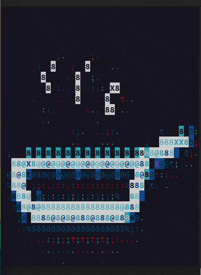

[](https://doi.org/10.5281/zenodo.7901425)
# :stew: POTFUL


POTFUL Plant cO-expression Transcription Factor regULators





# Setup
A major requirement for `POTFUL` is `RUST`. The user must first install RUST on the OS of their choice.

## Install Rust
Linux, WSL2 and mac OS
```{tab-item} 
    curl https://sh.rustup.rs -sSf | sh
```

Windows 11/10
```{tab-item} 
    run [vs_BuildTools.exe](https://aka.ms/vs/17/release/vs_BuildTools.exe) # `Microsoft C++ Build Tools`
    run rustup-init.exe[https://win.rustup.rs/]
```


You can learn a lot more at [The Cargo Book](https://doc.rust-lang.org/cargo/getting-started/installation.html). 


## Create conda environment

Fedora (36<) and Ubuntu (22<) and WSL2
[POTFUL.yml](https://github.com/nilesh-iiita/POTFUL/blob/main/POTFUL.yml)
```{tab-item} 
    conda env create -n POTFUL --file POTFUL.yml
```
Mac OS
[POTFUL_macPy39.yml](https://github.com/nilesh-iiita/POTFUL/blob/main/POTFUL_macPy39.yml)
```{tab-item} 
    conda env create -n POTFUL --file POTFUL_macPy39.yml
```

Windows 11/10
[POTFUL_WinPy39.yml](https://github.com/nilesh-iiita/POTFUL/blob/main/POTFUL_WinPy39.yml)
```{tab-item} 
conda env create -n POTFUL --file POTFUL_WinPy39.yml
```


## Clone git repository

Fork the [POTFUL](https://github.com/nilesh-iiita/POTFUL) git repository and clone or download.

    git clone https://github.com/<User Name>/POTFUL.git


# 
:point_right:[Full page Demo](https://nilesh-iiita.github.io/POTFUL/intro.html)

# Credits
POTFUL was originally written by [Nilesh Kumar](https://github.com/nilesh-iiita).

We thank the following people for their extensive assistance in the development of this pipeline:

We would also like to thank the following people and groups for their support, including financial support:

[Dr. Shahid Mukhtar](https://sites.uab.edu/smukhtarlab/)
Dept. of Biology University of Alabama at Birmingham


# Cite 

<a href="https://doi.org/10.1016/j.xpro.2022.101608"></a>
-
<a href="https://doi.org/10.5281/zenodo.6800259"></a>

```
@article{kumar2022pipeline,
  title={A pipeline of integrating transcriptome and interactome to elucidate central nodes in host-pathogens interactions},
  author={Kumar, Nilesh and Mishra, Bharat and Mukhtar, M Shahid},
  journal={STAR protocols},
  volume={3},
  number={3},
  pages={101608},
  year={2022},
  publisher={Elsevier}
}
```
